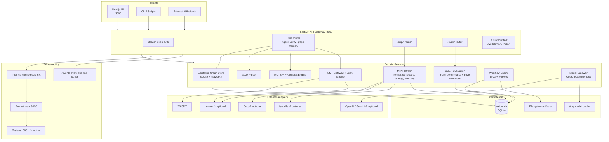

# AXIOM Labs — Architecture Audit

**Auditor role:** Chief Technology Officer (onboarding)  
**Audit date:** 2026-08-06  
**Companion document:** `REPOSITORY_AUDIT.md`  
**Authoritative contracts:** `ARCHITECTURE.md`, `docs/architecture.md`, `.axiom/ENGINEERING.md`

---

## 1. System purpose and architectural intent

AXIOM is designed as a **research-engineering platform** that converts evidence into bounded, inspectable technical work. The initial wedge is **mathematical intelligence**: ingest literature, represent knowledge in an epistemic graph, generate and verify conjectures, measure capability objectively, and expose results through an API and researcher workspace UI.

The architecture contract (`ARCHITECTURE.md`) defines four layers:

| Layer | Responsibility | Must not do |
|-------|----------------|-----------|
| **Interfaces** | HTTP/UI, auth, schema validation | Embed domain or persistence rules |
| **Domain capability** | Research logic, search, scoring, verification orchestration | Depend on request globals or UI state |
| **Evidence and state** | Provenance, graph entities, runs, evaluations, audit history | Claim stronger evidence than exists |
| **Adapters** | Databases, subprocess provers, model APIs, queues | Leak provider behavior through domain API |

**Verdict:** The codebase largely follows this intent in directory structure, but **violates the evidence layer contract** in verification and evaluation paths where simulation results are not consistently tier-labeled.

---

## 2. Current topology



---

## 3. Module architecture assessment

### 3.1 Core platform (`axiom/core/`)

**Purpose:** Scientific discovery kernel — knowledge representation, ingestion, reasoning, verification.

| Module | Design quality | Implementation fidelity | Notes |
|--------|---------------|------------------------|-------|
| `knowledge_graph/` | **Good** | **Good** | Clean separation: schema (Pydantic) → db (SQLite) → migrations (versioned). NetworkX export for analytics. |
| `parser/` | **Adequate** | **Partial** | Regex-based LaTeX extraction works for MVP; no corpus-scale validation. |
| `reasoning/mcts.py` | **Adequate** | **Partial** | Regex rewrite rules + MCTS; not Mathlib-informed despite EPIC-002 spec ambitions. |
| `reasoning/hypothesis_engine.py` | **Good** | **Partial** | Template-based conjectures from verified claims; limited novelty. |
| `reasoning/self_improvement.py` | **Weak** | **Stub** | Static rubric scoring, not live measurement. Writes `roadmap.md`. |
| `verification/smt_gateway.py` | **Adequate** | **Partial** | Real Z3 when available; grid fallback; **`eval()` on user input** is a security defect. |
| `verification/lean_exporter.py` | **Good** | **Partial** | Generates valid Lean 4 syntax; compilation often simulated. |
| `symbolic/sympy_engine.py` | **Good** | **Good** | SymPy with pure-Python fallback. |
| `retrieval/engine.py` | **Good** | **Good** | Theorem matching with canonicalization — but HTTP router not mounted. |
| `memory/working_memory.py` | **Good** | **Good** | Simple in-process session state. Duplicated by MIP episodic memory. |
| `events/bus.py` | **Adequate** | **Good** | In-process only; not durable across workers. |

**Assessment:** Core is the strongest architectural layer. Schema-driven design with explicit migrations is the right foundation for a research platform.

### 3.2 Mathematical Intelligence Platform (`axiom/mip/`)

**Purpose:** EPIC-001 — structured mathematical reasoning organized as "departments" A–H.

| Department | Module | Status |
|------------|--------|--------|
| A — Knowledge | `knowledge/` | **Implemented** — ontology, schema, migrations v5 |
| B — Formal | `formal/` | **Partial** — Lean/Coq/Isabelle generators; simulation fallback |
| C — Counterexample | `counterexample/` | **Empty** — package stub only |
| D — Conjecture | `conjecture/` | **Implemented** — 5 generation strategies + novelty scoring |
| E — Proof | `proof/` | **Empty** — package stub only |
| F — Strategy | `strategy/` | **Implemented** — static millennium problem decomposition trees |
| G — Memory | `memory/` | **Implemented** — episodic + semantic + failure guard |
| H — Verification | `verification/` | **Partial** — consensus orchestrator with keyword heuristics |

**Assessment:** MIP has a well-organized departmental structure but **two of eight departments are empty stubs**. The HTTP router exposes MIP without authentication, creating a security boundary violation relative to core routes.

### 3.3 Evaluation platform (`axiom/evaluation/`)

**Purpose:** EPIC-002 SCEP — objective capability measurement.

| Component | Status | Quality |
|-----------|--------|---------|
| `frameworks/capability.py` | Complete | 8 dimensions, L0–L5, composite formula |
| `frameworks/prize_readiness.py` | Complete | 6 Clay problems, weighted prerequisites, CIs |
| `benchmarks/suite.py` | Complete | Runnable benchmarks per dimension |
| `reporting/delta_report.py` | Complete | Markdown + JSON delta generation |
| `run_benchmarks.py` | Complete | CLI with `--compare-previous` regression guard |
| `prize_readiness.py` (legacy) | **Broken** | Syntax error line 77; still wired to `/benchmark/prize-readiness` |

**Assessment:** SCEP is architecturally sound and represents the platform's most mature "evidence infrastructure." The legacy scorer must be deprecated or fixed immediately to prevent import failures.

### 3.4 Workflow engine (`axiom/workflow/`)

**Purpose:** Autonomous multi-step research workflows with DAG scheduling.

| Component | Status |
|-----------|--------|
| `engine.py` — WorkflowEngine | Implemented, SQLite-backed |
| `scheduler.py` — DAG planning | Implemented with cycle detection |
| `executor.py` — Parallel execution | Implemented with retries |
| `workers/` — 5 worker types | Partial (ResearcherWorker is stub) |
| `routes/workflow_router.py` | Implemented but **not mounted** |

**Assessment:** Workflow engine is a well-designed subsystem that is effectively **dead code** until the router is mounted in `main.py`.

### 3.5 Services layer (`axiom/services/`)

| Service | Assessment |
|---------|-----------|
| `api_gateway/main.py` | Central composition root. Mounts MIP + eval; missing workflow + MDE. Singleton pattern for store/parser/solvers. |
| `api_gateway/auth.py` | JWT + RBAC defined but endpoints use simple Bearer token check. |
| `api_gateway/routes/` | 4 route modules; 2 unmounted. |
| `model_gateway/client.py` | Clean adapter with cache and mock fallback. |

### 3.6 Frontend (`ui/`)

| Aspect | Assessment |
|--------|-----------|
| Architecture | Single-page-app style within Next.js App Router; no component library |
| State management | React `useState`/`useEffect` only |
| API coupling | Hardcoded `localhost:8000`; no API client abstraction |
| Graph visualization | Hand-rolled SVG force-directed layout (~400 LOC) |
| Auth | Token in plain-text input, stored in component state |

**Assessment:** UI is a **credible prototype** for internal demos, not a production research workspace. The workspace page demonstrates the core value loop (ingest → graph → verify) but covers <15% of API surface.

---

## 4. Data architecture

### 4.1 Storage model

All persistent state lives in a **single SQLite file** (`axiom.db` by default) with multiple table namespaces:

| Namespace | Tables | Owner module | Migration version |
|-----------|--------|-------------|-------------------|
| EGS | `nodes`, `edges`, `mathematical_objects`, `definitions`, `equivalent_statements`, `memory_snapshots`, `failed_proof_attempts` | `core/knowledge_graph/` | v4 |
| MIP | `mip_objects`, `mip_edges`, `mip_domains`, `mip_axiom_systems`, `mip_proof_attempts`, `mip_conjectures`, `mip_memory_snapshots` | `mip/knowledge/` | v5 |
| Evaluation | `eval_runs`, `eval_readiness`, `eval_results` | `evaluation/` | Created on first run |
| Workflow | `workflow_runs`, `workflow_events` | `workflow/engine.py` | Inline schema |

### 4.2 Data flow patterns

**Ingest flow:**
```
POST /ingest → ArxivParser.parse_paper() → EpistemicStore.add_node()
           → event_bus.publish(PAPER_INGESTED)
```

**Verification flow:**
```
POST /verify/conjecture → SmtGateway.verify_modular_conjecture()
                        → store.add_node(claim, status=VERIFIED|REFUTED)

POST /verify/proof → MctsSolver.solve() → LeanExporter.export_theorem()
                   → subprocess lean (or simulation) → store.add_node()
```

**Evaluation flow:**
```
POST /eval/run → BenchmarkSuite.run_all() → CapabilitySnapshot
              → PrizeReadinessEngine.compute() → eval_runs INSERT
              → generate_delta_report() → docs/capability_delta_{id}.md
```

### 4.3 Data architecture risks

| Risk | Severity | Detail |
|------|----------|--------|
| **Split-brain DB paths** | High | `settings.db_path` vs `os.getenv("AXIOM_DB_PATH")` in MIP router |
| **SQLite + multi-worker** | High | Docker runs 2 uvicorn workers sharing one SQLite file |
| **No migration coordination** | Medium | EGS v4 and MIP v5 migrations run independently; no unified version |
| **JSON blob polymorphism** | Medium | Nodes stored as JSON in SQLite; schema evolution relies on Pydantic parsing |
| **Capability delta proliferation** | Medium | 180 markdown reports committed/untracked; no archival policy |
| **No backup strategy** | Medium | Single file, volume-mounted in Docker, no documented backup |

---

## 5. Result integrity model

The architecture contract requires every material result to answer:

1. What claim was produced?
2. What inputs, tool versions, configuration, and run ID produced it?
3. Was it generated, heuristically checked, simulated, independently checked, or formally compiled?
4. Can it be reproduced?

### 5.1 Current compliance

| Path | Provenance | Tier labeling | Reproducibility |
|------|-----------|---------------|-----------------|
| SMT verification | Partial (modulus range logged) | Implicit via status enum | Moderate |
| Lean proof export | Partial (script stored) | **Weak** — simulation can claim success | Low without compiler |
| MIP formal compile | Partial | **Weak** — simulation fallback | Low |
| SCEP benchmarks | Good (run_id, timestamp) | **Incomplete** — no `estimated=True` on fallbacks | Good (deterministic suite) |
| Prize readiness | Good (CI bounds) | Good in `/eval` API | Moderate (small N) |
| Legacy prize scorer | Poor | **Broken** (syntax error) | Unknown |
| Workflow artifacts | Good (versioned filesystem) | N/A | Good |

### 5.2 Integrity violations (from EPIC-002 audit)

| Finding | Risk | Architectural fix |
|---------|------|-------------------|
| F1: Synthetic baseline fallbacks | HIGH | Add `estimated` metadata to `CapabilitySnapshot`; lower confidence |
| F2: Compiler simulation | CRITICAL | Enforce `TIER_1_SIMULATED` max score 0.70; require exit code 0 for `TIER_2_PROVEN` |
| F3: Static benchmarks | MEDIUM | Dynamic parameterization service |
| F4: Baseline drift | LOW | Immutable `baseline_epic001` in `eval_runs` |
| F5: Wide confidence intervals | MODERATE | Flag ΔCI > 0.30 as "HIGH VARIANCE / PRELIMINARY" |

**Verdict:** The result integrity model is **architecturally specified but not enforced in code**. This is the single highest architectural risk for a platform whose mission includes formal verification and prize readiness.

---

## 6. Security architecture

### 6.1 Authentication and authorization

```
Request → CORSMiddleware → FastAPI route
                              ├── Core routes: Depends(verify_token) → Bearer check
                              ├── MIP routes: No auth
                              └── Eval routes: No auth
```

| Control | Status |
|---------|--------|
| Bearer token auth | Implemented for core routes |
| JWT generation/validation | Code exists, not used by endpoints |
| RBAC (ADMIN/RESEARCHER/READONLY) | Defined, not enforced per-route |
| Rate limiting | **Absent** |
| Input validation | Pydantic models on POST bodies |
| Secret management | `.env` file; defaults in source |

### 6.2 Security findings

| ID | Finding | Severity |
|----|---------|----------|
| SEC-01 | Default API token `axiom-dev-token` in `.env.example` | High |
| SEC-02 | Grafana password `axiom-admin` in `docker-compose.yml` | High |
| SEC-03 | `eval()` on user equations in SMT gateway | Critical (if exposed to untrusted users) |
| SEC-04 | `/metrics` and `/events` unauthenticated | Medium |
| SEC-05 | MIP and eval endpoints unauthenticated | Medium |
| SEC-06 | CORS `allow_methods=["*"]`, `allow_headers=["*"]` | Low (dev acceptable) |
| SEC-07 | No TLS/HTTPS in any configuration | Medium |
| SEC-08 | Security CI never fails (`pip-audit \|\| true`) | Medium |

---

## 7. Observability architecture

| Signal | Implementation | Production readiness |
|--------|---------------|-------------------|
| Structured logging | JSON/console via `observability/logger.py` | Good |
| Metrics | In-process counters/histograms, `/metrics` endpoint | Adequate |
| Tracing | **Absent** | Not started |
| Health checks | `/health` (liveness), `/ready` (DB) | Good |
| Event bus history | `/events` ring buffer | Dev-only |
| Prometheus | Scrape config present | Works for API |
| Grafana | Referenced, provisioning missing | Broken |
| Alerting | **Absent** | Not started |

---

## 8. Deployment architecture

### 8.1 Current deployment model

```
Developer → make dev (uvicorn --reload) + make dev-ui (npm run dev)
CI → ruff + mypy + pytest (BROKEN)
CD → Docker build API → push ghcr.io/<repo>/axiom-api
Production → scripts/deploy.sh → docker compose up (BROKEN for UI/Grafana)
```

### 8.2 Deployment gaps

| Component | Local dev | Docker | CI | Production |
|-----------|-----------|--------|-----|-----------|
| API | Works | Works | Broken (lint) | Image exists |
| UI | Works | **No Dockerfile** | **No CI** | Not deployable |
| Prometheus | Via compose | Works | N/A | Partial |
| Grafana | **Broken** | **Broken** | N/A | Not deployable |
| Lean 4 | Not installed | Not in image | Not in CI | Not available |

### 8.3 Recommended target architecture (90-day horizon)

```text
Phase 1 (baseline):
  Single API container + SQLite + local dev UI
  CI: lint + test + UI build on every PR

Phase 2 (staging):
  API container + UI container + Prometheus
  Lean 4 sidecar or multi-stage Docker with Mathlib
  Postgres evaluation (optional; SQLite acceptable for MVP)

Phase 3 (alpha):
  Reverse proxy (Caddy/nginx) with TLS
  Secret manager integration
  Auth unified across all routes
```

---

## 9. Architectural boundaries and coupling

### 9.1 Clean boundaries (preserve)

- Pydantic schemas as contract between layers
- Adapter pattern for formal provers (Lean/Coq/Isabelle)
- Evaluation framework independent of API gateway
- Settings via environment variables (12-factor)

### 9.2 Problematic coupling (reduce)

| Coupling | Impact | Recommendation |
|----------|--------|----------------|
| `self_improvement.py` imports legacy `prize_readiness.py` | Import chain failure | Fix or remove legacy import |
| MIP router uses env var instead of settings | Config drift | Unify on `AxiomSettings` |
| E2E tests embed production logic | Test/code divergence | Extract shared modules or delete tests |
| Dual prize readiness systems | Score inconsistency | Deprecate legacy 5-dim scorer |
| Dual working memory | UX confusion | Single memory abstraction with namespaces |
| `main.py` as god composition root | Growing include list | Route registry pattern |

### 9.3 Missing boundaries (add)

| Boundary | Why needed |
|----------|-----------|
| Verification tier enum enforced at API response layer | Prevent false proof claims |
| `estimated` flag on all evaluation scores | Audit compliance |
| API client abstraction in UI | Enable environment-specific URLs |
| Job queue between API and long-running benchmarks | Prevent request timeout on `/eval/run` |

---

## 10. Test architecture

### 10.1 Test pyramid (actual vs. intended)

```text
                    ┌─────────────┐
                    │  E2E (~226) │  ← Many test embedded helpers, not production code
                    ├─────────────┤
                    │ Integration │  ← SCEP e2e (8), eval API (5)
                    ├─────────────┤
                    │  Unit (~80) │  ← Core, MIP, verification
                    └─────────────┘

Intended: tests validate production code
Actual:   E2E layer often validates test-local implementations
```

### 10.2 Test infrastructure defects

| Defect | Impact |
|--------|--------|
| Root `pytest.py` shadows pytest | Entire suite non-runnable via standard commands |
| `prize_readiness.py` syntax error | conftest import fails |
| E2E not in CI | 226 specs never gated |
| No UI tests | Frontend untested |
| Custom pytest runner in root | Confusion for contributors and CI |

---

## 11. Architectural risk register

| ID | Risk | Likelihood | Impact | Mitigation priority |
|----|------|-----------|--------|-------------------|
| AR-01 | False formal verification claims | High | Critical | S0-E3: tier enforcement + regression tests |
| AR-02 | Test suite non-runnable | Certain | Critical | S0-E2: fix pytest shadow + syntax error |
| AR-03 | E2E/production divergence | High | High | Mount routers or align tests to production |
| AR-04 | SQLite corruption under load | Medium | High | Single worker or migrate to Postgres |
| AR-05 | Capability score inflation | High | High | `estimated` metadata + baseline lock |
| AR-06 | Security defaults in production | Medium | High | Fail deploy on default secrets |
| AR-07 | Monolith scaling ceiling | Low (near-term) | Medium | Defer until multi-user alpha |
| AR-08 | Agent artifact trust | High | Medium | Re-verify all gates post-baseline |

---

## 12. Architecture maturity scorecard

| Dimension | Score (1–5) | Rationale |
|-----------|-------------|-----------|
| Modularity | 4 | Clean package structure, explicit interfaces |
| Evidence integrity | 2 | Specified but not enforced |
| Testability | 2 | Extensive tests exist but cannot run reliably |
| Security | 2 | Auth exists but inconsistently applied |
| Observability | 3 | Logging + metrics; no tracing |
| Deployability | 2 | API only; UI/Grafana broken |
| Documentation | 4 | Strong contracts and architecture docs |
| Scalability | 2 | SQLite monolith, in-process bus |
| **Overall** | **2.6 / 5** | Strong design intent, weak operational enforcement |

---

## 13. Recommended architectural decisions (pending human approval)

| Decision | Options | Recommendation |
|----------|---------|----------------|
| AD-01: Legacy prize scorer | Fix / deprecate / remove | **Deprecate** — redirect `/benchmark/prize-readiness` to SCEP engine |
| AD-02: pytest.py | Rename / delete / move to scripts | **Rename** to `scripts/standalone_test_runner.py` |
| AD-03: Unmounted routers | Mount / delete | **Mount** behind auth after smoke tests |
| AD-04: SQLite vs Postgres | Keep SQLite / migrate | **Keep SQLite** for MVP; single worker in Docker |
| AD-05: Capability delta storage | Git / artifact store / DB only | **DB + milestone markdown only**; stop committing 180 files |
| AD-06: Lean 4 in Docker | Sidecar / multi-stage / defer | **Multi-stage Docker** with Mathlib (EPIC-003) |
| AD-07: UI architecture | Keep inline / extract components | **Extract components** when adding 3rd page |

---

*This architecture audit is observational. Implementation of recommendations requires task queue entries and human approval per `.axiom/CONSTITUTION.md`.*
