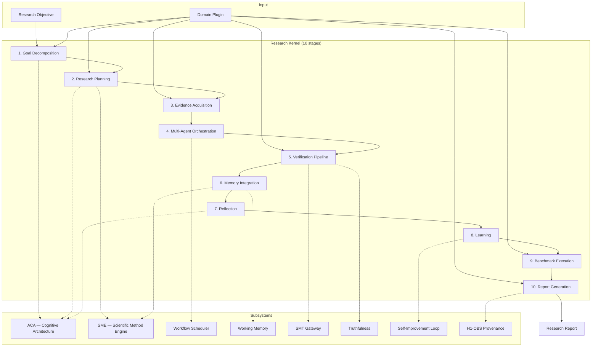

# Research Kernel Architecture

## Design Principles

1. **Orchestrate, don't duplicate** — The kernel coordinates existing AXIOM subsystems; it does not reimplement them.
2. **Plugins over forks** — New research domains add a plugin; the kernel pipeline is unchanged.
3. **Stable stage contract** — All 10 stages execute in order for every run; no stage may be skipped.
4. **Evidence explicit** — Every artifact carries an evidence tier; verification outcomes are never conflated.

## System Diagram



## Component Responsibilities

### ResearchKernel (`engine.py`)

- Creates and persists `KernelRun` records
- Enforces stage ordering via `KernelStageIncompleteError`
- Records H1-OBS provenance on completion
- Public API: `create_run()`, `execute_stage()`, `run_full_cycle()`

### StageExecutor (`pipeline.py`)

- Maps each `KernelStage` to a handler function
- Instantiates subsystem clients once per executor
- Returns `StageOutput` with subsystem attribution and timing
- Mutates `run.context` with stage artifacts

### KernelStore (`store.py`)

- SQLite persistence for `kernel_runs` table
- JSON blob stores full `KernelRun` state
- Supports list/filter by domain

### Plugin Registry (`registry.py`)

- Built-in plugins: mathematics, computer_science, vlsi_hardware
- `register_plugin()` for extensions
- `kernel_manifest()` for API discovery

## Stage-to-Subsystem Mapping

| Stage | Handler | Subsystem(s) | Plugin Method |
|-------|---------|--------------|---------------|
| Goal Decomposition | `_goal_decomposition` | ACA (perception) | `decompose_goal` |
| Research Planning | `_research_planning` | ACA (planning), SME | `research_plan` |
| Evidence Acquisition | `_evidence_acquisition` | EGS (via plugin) | `acquire_evidence` |
| Multi-Agent Orchestration | `_multi_agent_orchestration` | WorkflowScheduler | `orchestration_tasks` |
| Verification Pipeline | `_verification_pipeline` | SMT, truthfulness | `verify` |
| Memory Integration | `_memory_integration` | WorkingMemory, SME | — |
| Reflection | `_reflection` | ACA cycle state | — |
| Learning | `_learning` | SelfImprovementLoop | — |
| Benchmark Execution | `_benchmark_execution` | Plugin benchmarks | `benchmarks`, `run_benchmark` |
| Report Generation | `_report_generation` | reports.py | `generate_domain_report` |

## Data Model

```python
KernelRun
├── run_id: str
├── objective: str
├── domain: str
├── plugin_id: str
├── status: KernelRunStatus
├── current_stage: KernelStage
├── stages_completed: list[KernelStage]
├── stage_outputs: list[StageOutput]
├── context: dict[str, Any]        # Cross-stage artifact store
├── aca_cycle_id: str | None       # Linked ACA cycle
├── sme_session_id: str | None     # Linked SME session
├── workflow_id: str | None        # Linked workflow
├── report: str | None             # Final markdown report
├── benchmark_results: list[dict]
└── created_at / updated_at
```

## Integration with Governance Stack

```
ACA (how AXIOM thinks)
  ↓ linked via aca_cycle_id
Research Kernel (how AXIOM executes research)
  ↓ linked via sme_session_id
SME (how AXIOM researches scientifically)
  ↓ workflow gate
Workflow Engine (how AXIOM coordinates agents)
  ↓
H1-OBS (what AXIOM did — provenance)
```

The kernel sits between cognitive reasoning and scientific method enforcement. It creates ACA cycles and SME sessions during early stages, then carries their artifacts through verification, memory, and reporting.

## API Layer

`axiom/services/api_gateway/routes/kernel_api.py` exposes REST endpoints under `/kernel/*`. The API is a thin wrapper over `ResearchKernel` — no business logic in routes.

## Extension Points

| Extension | Mechanism | Stability |
|-----------|-----------|-----------|
| New domain | Implement `ResearchDomainPlugin`, call `register_plugin()` | Stable |
| New stage | Requires kernel version bump | Breaking |
| Custom context | Pass via `create_run(context=...)` | Stable |
| Report template | Override `generate_kernel_report()` | Stable |

## Persistence Schema

```sql
CREATE TABLE kernel_runs (
    run_id TEXT PRIMARY KEY,
    objective TEXT NOT NULL,
    domain TEXT NOT NULL,
    plugin_id TEXT NOT NULL,
    status TEXT NOT NULL,
    current_stage TEXT NOT NULL,
    json_data TEXT NOT NULL,
    created_at TEXT NOT NULL,
    updated_at TEXT NOT NULL
);
```

Full run state (including `context`, `stage_outputs`, `report`) is stored as JSON in `json_data`.

## Error Handling

- `KernelStageIncompleteError` — Stage failed or out-of-order execution attempted
- `KeyError` — Unknown plugin_id
- `ValueError` — Run not found

Failed stages set `run.status = FAILED` and persist before raising.

## Testing Strategy

- Unit tests: full cycle per domain, stage ordering, persistence
- API tests: create/run/report flow via TestClient
- Benchmark: 3-domain compliance run via `make kernel-benchmark`

## Future Architecture

See recommended improvements in `RESEARCH_KERNEL.md`. Highest-impact next steps:

1. RVP benchmark integration for cross-domain capability scoring
2. Real workflow worker execution (not just scheduling)
3. Plugin entry-point discovery via `pyproject.toml`
