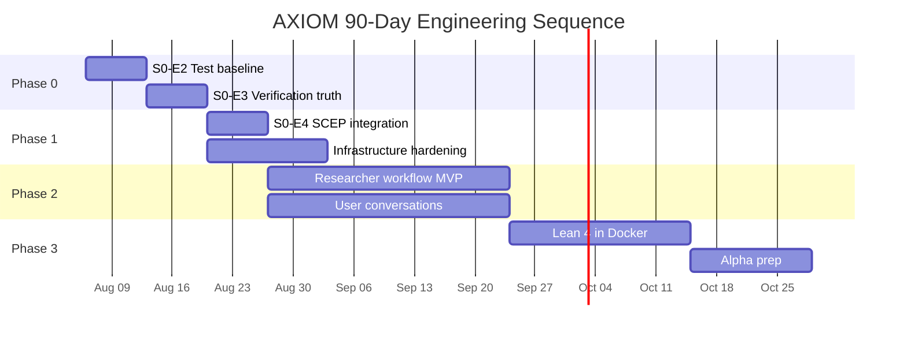

# AXIOM Labs — Next 90 Days

**Author:** Chief Technology Officer (onboarding)  
**Date:** 2026-08-06  
**Horizon:** 2026-08-06 → 2026-11-04  
**Prerequisites:** `REPOSITORY_AUDIT.md`, `ARCHITECTURE_AUDIT.md`, `CURRENT_STATE.md`

---

## Strategic frame

AXIOM's next 90 days must convert a **promising prototype with unverified claims** into a **trustworthy research-engineering platform with honest external positioning**. The three tracks (Research, Product, Company) continue in parallel, but Track A (engineering baseline) gates what Tracks B and C may claim.

**Guiding principle:** Evidence before claims. No external scientific positioning, investor capability numbers, or production deployment until S0-E2 and S0-E3 are complete.

---

## Phase overview

```text
Week 1–2   │ PHASE 0: Trustworthy Baseline (S0-E2, S0-E3)
           │ Fix toolchain, green CI, verification tier enforcement
───────────┼──────────────────────────────────────────────────
Week 3–4   │ PHASE 1: Integration & Integrity (S0-E4, infra)
           │ Unify prize readiness, mount routers, fix Docker/CI
───────────┼──────────────────────────────────────────────────
Week 5–8   │ PHASE 2: Researcher Workflow MVP (Product M1)
           │ End-to-end workflow, UI expansion, first user conversations
───────────┼──────────────────────────────────────────────────
Week 9–12  │ PHASE 3: Compiler Truth & Alpha Prep (EPIC-003 start)
           │ Lean 4 in Docker, dynamic benchmarks, alpha infrastructure
```

---

## Phase 0: Trustworthy Baseline (Weeks 1–2)

**Objective:** Establish a reproducible, green test baseline and enforce verification truthfulness.

### Epic S0-E2 (revised) — Restore test baseline

| Task | Owner | Acceptance signal | Effort |
|------|-------|-------------------|--------|
| Rename `pytest.py` → `scripts/standalone_test_runner.py` | Engineering | `python -m pytest tests/` collects all test files | Trivial |
| Fix `prize_readiness.py:77` syntax error | Engineering | `import axiom.evaluation.prize_readiness` succeeds | Trivial |
| Fix `ruff.toml` (`[ruff]` not `[tool.ruff]`) | Engineering | `ruff check axiom/ tests/` exits 0 | Trivial |
| Add `poetry.lock` or pinned `requirements-lock.txt` | Engineering | Reproducible install documented | Small |
| Run full test suite, record results | Engineering | Results in `.axiom/MEMORY.md` with pass/fail counts | Small |
| Triage failing tests | Engineering | Each failure: fix, quarantine with `@pytest.mark.skip(reason=...)`, or delete with justification | Medium |
| Restore CI to green | Engineering | GitHub Actions CI workflow passes on `main` | Small |
| Update `.axiom/CURRENT_STATE.md` | PMO | Blocker removed; baseline numbers recorded | Trivial |

**Exit criteria:** `make check` (lint + type-check + test) passes locally and in CI. Results published honestly, including failures.

### Epic S0-E3 — Verification truthfulness audit

| Task | Owner | Acceptance signal | Effort |
|------|-------|-------------------|--------|
| Audit all verification code paths | Engineering | Inventory of every path that sets `TIER_*` or `VERIFIED` status | Small |
| Enforce tier labeling in API responses | Engineering | Simulation results always `TIER_1_SIMULATED`; only compiler exit 0 → `TIER_2_PROVEN` | Medium |
| Cap simulated scores at 0.70 in benchmarks | Engineering | `suite.py` respects audit Finding 2 | Small |
| Add `estimated: bool` to evaluation scores | Engineering | Fallback baselines tagged `estimated=True` | Small |
| Regression tests for false-claim prevention | Engineering | Tests prove simulated result cannot claim formal proof | Medium |
| Update `docs/api.md` with tier semantics | Engineering | API docs match enforced behavior | Small |

**Exit criteria:** No API response can label a fallback/simulated verification as a formal proof. Audit Findings 1 and 2 have code-level mitigations (not just documentation).

---

## Phase 1: Integration & Integrity (Weeks 3–4)

**Objective:** Resolve architectural fragmentation and restore deployability.

### Epic S0-E4 — EPIC-002 integration gate

| Task | Owner | Acceptance signal | Effort |
|------|-------|-------------------|--------|
| Deprecate legacy 5-dim `PrizeReadinessScorer` | Engineering | `/benchmark/prize-readiness` delegates to SCEP engine; deprecation warning | Small |
| Remove `self_improvement.py` import of legacy scorer | Engineering | No import chain through broken module | Trivial |
| Lock `baseline_epic001` in `eval_runs` | Engineering | Delta comparisons use persistent baseline (Audit Finding 4) | Small |
| Flag wide CIs as "HIGH VARIANCE / PRELIMINARY" | Engineering | ΔCI > 0.30 flagged in API and delta reports (Finding 5) | Small |
| Integration tests for SCEP end-to-end | Engineering | Full `/eval/run` → delta report → regression guard in CI | Medium |

### Infrastructure hardening

| Task | Owner | Acceptance signal | Effort |
|------|-------|-------------------|--------|
| Create `ui/Dockerfile` (multi-stage Next.js) | Engineering | `docker compose up` builds UI | Medium |
| Create `deploy/grafana/provisioning/` | Engineering | Grafana starts without volume mount error | Small |
| Add UI CI job (lint + build) | Engineering | `npm ci && npm run lint && npm run build` in CI | Small |
| Unify DB path on `settings.db_path` | Engineering | MIP router uses settings, not raw env var | Trivial |
| Single uvicorn worker in Docker (or Postgres) | Engineering | No SQLite corruption under concurrent writes | Small |
| Wire `NEXT_PUBLIC_API_URL` in UI | Engineering | Workspace uses env var, not hardcoded localhost | Trivial |
| Fix default auth token mismatch (UI vs backend) | Engineering | UI default matches `.env.example` | Trivial |
| Make security CI blocking | Engineering | `pip-audit` failure blocks merge; add `npm audit` | Small |
| Gitignore or archive capability delta reports | Engineering | Only milestone deltas committed; rest in DB or artifact store | Small |
| Add PR template | Engineering | `.github/PULL_REQUEST_TEMPLATE.md` exists | Trivial |

**Exit criteria:** `docker compose up` starts all 4 services. CI runs Python + UI pipelines. Security audit blocks on critical vulnerabilities.

---

## Phase 2: Researcher Workflow MVP (Weeks 5–8)

**Objective:** Deliver one end-to-end workflow a mathematical researcher can understand, try, and evaluate. (Product Milestone 1 from `.axiom/ROADMAP.md`)

### Core workflow (define and implement)

```text
Researcher journey:
  1. Set research problem          → POST /memory/problem
  2. Ingest relevant paper         → POST /ingest (arXiv ID)
  3. Explore knowledge graph       → GET /graph (visualized in workspace)
  4. Generate hypotheses           → POST /hypothesize
  5. Verify a conjecture           → POST /verify/conjecture (SMT)
  6. Attempt proof                 → POST /verify/proof (MCTS + Lean)
  7. Review capability scores      → GET /eval/scores
  8. Export/session snapshot       → (new) provenance record
```

| Task | Track | Acceptance signal | Effort |
|------|-------|-------------------|--------|
| Define workflow acceptance criteria | Product | Document in `.axiom/PRODUCT.md` with user, job, limits | Small |
| Implement `POST /query` (basic retrieval) | Research | Returns ranked results from EGS, not empty stub | Medium |
| Mount MDE router with auth | Engineering | `GET /mde/retrieval` works in production | Small |
| UI: hypothesize panel | Product | Workspace calls `/hypothesize`, displays conjectures on graph | Medium |
| UI: capability scores panel | Product | Workspace shows `/eval/scores` with dimension breakdown | Medium |
| UI: environment-aware API URL | Engineering | Works in Docker and local dev | Trivial |
| UI: component extraction (start) | Engineering | Shared `ApiClient`, `GraphCanvas`, `Panel` components | Medium |
| Functional waitlist backend | Company | Form submits to internal store or external service (human approves) | Small |
| Research plan with benchmark program | Research | `research/` plan names workflow, measurement, review cadence | Small |
| 5–10 structured user conversations | Product + Company | Recorded in `.axiom/MEMORY.md` with learnings (human conducts) | Ongoing |

**Exit criteria:** A researcher can complete steps 1–7 without reading source code. At least 5 structured conversations recorded with honest feedback. No user count claimed until measured.

### Parallel research work

| Task | Acceptance signal | Effort |
|------|-------------------|--------|
| arXiv parser precision/recall on 50-paper sample | Benchmark numbers in `MEMORY.md` | Medium |
| MCTS baseline comparison on fixed problem set | Scores recorded with provenance | Medium |
| Dynamic benchmark parameterization (Audit Finding 3) | `mr_*` cases use random seeds | Medium |

---

## Phase 3: Compiler Truth & Alpha Prep (Weeks 9–12)

**Objective:** Begin EPIC-003 (formal proof platform) and prepare for public alpha.

### EPIC-003 foundation (from audit recommendations)

| Task | Acceptance signal | Effort |
|------|-------------------|--------|
| Lean 4 + Mathlib in Docker image | `lean --version` in container; basic proof compiles | Large |
| Proof verification uses real compiler in CI | At least one CI job with Lean 4 subprocess | Large |
| Dynamic math problem generator | Benchmark cases parameterized with seeds | Medium |
| Analytic zeta zero verification suite (RH) | Resolves RH DISPUTED status in audit | Large |
| Mount workflow router | `POST /workflows` creates and runs a workflow | Medium |
| Implement `mip/counterexample/` (minimal) | Counterexample search for bounded modular claims | Medium |
| Reverse proxy with TLS (staging) | Caddy or nginx config for staging environment | Medium |
| Secret management | No default credentials in deploy path | Small |
| Observability: basic Grafana dashboard | API latency, error rate, eval run history | Medium |
| Alpha readiness checklist | Security, docs, limits, support plan documented | Small |

**Exit criteria:** At least one proof verified by real Lean 4 compiler in CI. Staging environment deployable with TLS. Alpha checklist complete (human approves external launch).

---

## 90-day metrics and evidence targets

| Metric | Day 0 (now) | Day 30 target | Day 60 target | Day 90 target |
|--------|-------------|---------------|---------------|---------------|
| CI status | Red | Green | Green | Green |
| Test suite runnable | No | Yes | Yes | Yes |
| Tests passing (honest count) | Unknown (22 SCEP only) | >200 documented | >300 documented | Full suite green |
| API endpoints with auth | ~50% | 100% | 100% | 100% |
| UI API coverage | 4/30+ | 8/30+ | 12/30+ | 15/30+ |
| Docker full stack | Broken | Working | Working | Working + TLS |
| Compiler-backed proofs in CI | 0 | 0 | 0 | ≥1 |
| Structured user conversations | 0 | 0 | 5 | 10–20 |
| Capability delta reports in git | 180 | <10 (milestone only) | <10 | <10 |
| RH prize readiness (audit-grounded) | 38/100 DISPUTED | 38/100 (honest) | 40/100 (if zeta suite) | Re-evaluated with evidence |

---

## Resource and dependency map



### Critical dependencies

| Task | Blocked by | Blocks |
|------|-----------|--------|
| S0-E2 | Nothing (start now) | Everything |
| S0-E3 | S0-E2 | External verification claims |
| S0-E4 | S0-E2, S0-E3 | Honest capability reporting |
| UI workflow expansion | S0-E2, API auth unification | Product M1 |
| User conversations | Workflow MVP demo-ready | Product validation |
| Lean 4 in Docker | S0-E2 green CI | EPIC-003, RH audit resolution |
| Public alpha | S0-E3, TLS, human approval | Company M2 |

---

## What we will NOT do in 90 days

Explicit non-goals to prevent scope creep:

| Non-goal | Rationale |
|----------|-----------|
| Claim prize problem progress | No verified novel contribution exists |
| Production multi-tenant deployment | SQLite monolith not ready |
| Full MDE E2E feature set (F1–F21) | Test specs exceed production code |
| Mathlib theorem index (1000+ entries) | EPIC-002 spec scope; defer to EPIC-003+ |
| Autonomous research company workflows | Requires founder/scientist direction |
| Paid customer contracts | Human approval required per constitution |
| Publishing scientific results | Human approval required |
| Hiring | Human approval required |
| Fundraising materials with capability scores | Scores are internal hypotheses until baseline verified |

---

## Risk register for 90-day plan

| Risk | Likelihood | Impact | Mitigation |
|------|-----------|--------|------------|
| Test triage reveals widespread failures | High | Schedule slip | Honest recording; fix or quarantine, don't hide |
| Lean 4 Docker integration harder than expected | High | EPIC-003 delayed | Start early in week 9; accept simulation cap until ready |
| No user conversations happen | Medium | Product learning gap | Human must conduct; AI prepares materials only |
| Scope creep from agent-generated specs | Medium | Engineering distraction | Task queue is authoritative; specs need human approval |
| Capability delta report proliferation continues | High | Repo bloat | Gitignore policy in Phase 1 |
| Team capacity insufficient for 3 tracks | Medium | Parallel work stalls | P0 gate: Research baseline before Product expansion |

---

## Weekly PMO cadence (recommended)

| Day | Activity |
|-----|----------|
| Monday | Read `.axiom/` sources of truth; publish daily brief with top 5 priorities |
| Daily | Execute highest unblocked task; record evidence |
| Friday | Weekly review: completed work, test results, blockers, next week target |
| End of each phase | Update `CURRENT_STATE.md`, `TASK_QUEUE.md`, `MEMORY.md`, `CAPABILITIES.md` |

Use the daily brief template in `.axiom/PMO.md`.

---

## Highest-priority engineering task (Day 1)

**S0-E2 (revised): Restore a trustworthy, reproducible test baseline.**

Three trivial fixes unblock the entire engineering organization:

1. Rename `/pytest.py` → `/scripts/standalone_test_runner.py`
2. Fix `def score_all((self)` → `def score_all(self)` in `prize_readiness.py:77`
3. Change `[tool.ruff]` → `[ruff]` in `ruff.toml`

Then run the full suite, record results honestly, and restore CI.

**Everything else in this document is sequenced after this task.**

---

## Success definition at Day 90

AXIOM will have earned the right to call itself a research-engineering platform if:

1. CI is green with Python and UI pipelines
2. Verification tiers are enforced in code, not just documented
3. A researcher can complete the core workflow in the UI without reading source
4. 10–20 structured user conversations are recorded with honest learnings
5. At least one proof is verified by a real Lean 4 compiler in CI
6. Staging environment is deployable with TLS and no default secrets
7. All external claims are traceable to recorded evidence with stated limitations

Until then, AXIOM is an **internal prototype with strong architectural intent** — and should be described as such.

---

*This plan is a proposal for leadership review. Task queue entries in `.axiom/TASK_QUEUE.md` remain authoritative until updated through the operating cycle.*
