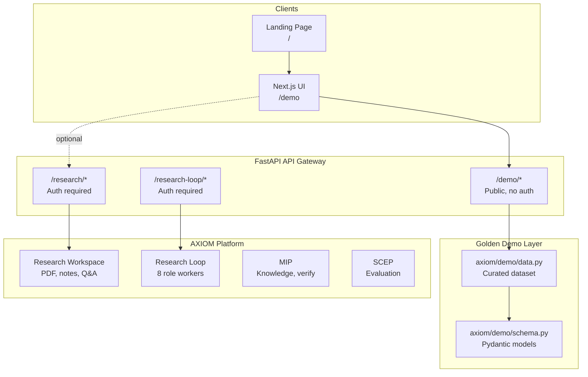

# AXIOM Golden Demo — Architecture Diagram

## Component Responsibilities

| Layer | Path | Role |
|-------|------|------|
| Demo UI | `ui/src/app/demo/` | Auto-play, tour, visualizations |
| Demo API | `axiom/services/api_gateway/routes/demo.py` | Serve curated state |
| Demo data | `axiom/demo/data.py` | Single source of demo truth |
| Sample dataset | `demo/sample_dataset/` | Paper excerpts + expected outputs |

## Data Flow (Play Demo)

1. UI fetches `GET /demo/state`
2. Phase state machine reveals sections with timed animations
3. Evidence graph, timeline, and tree render from API payload
4. No database writes — demo is read-only and deterministic

## Integration Points

The Golden Demo **showcases** capabilities from Research Workspace and Research Loop without requiring live LLM calls. Future versions may wire Play Demo to seed a real project via `POST /research/projects`.
