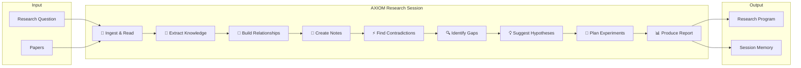

# AXIOM Golden Demo — Product Diagram

## User Journey (5 minutes)

| Step | User sees | Value |
|------|-----------|-------|
| 1 | Project + question | Clarity of intent |
| 2 | Papers reading | Ingest without manual note-taking |
| 3 | Knowledge graph | Relationships made visible |
| 4 | Notes | Structured, searchable insights |
| 5 | Contradictions | Intellectual honesty |
| 6 | Gaps | Where to contribute |
| 7 | Hypotheses | Testable science |
| 8 | Experiments | Actionable lab plan |
| 9 | Report | Deliverable output |

## Product Positioning

**AXIOM is not a chatbot.** It is a research session that produces structured, evidence-classified outputs with memory.

| ChatGPT | AXIOM Golden Demo |
|---------|-------------------|
| Conversational | Session-based |
| Ephemeral | Remembers full context |
| Unstructured prose | Graph, notes, report |
| No contradiction handling | Explicit conflict resolution |
| No experiment planning | Linked hypotheses → experiments |
