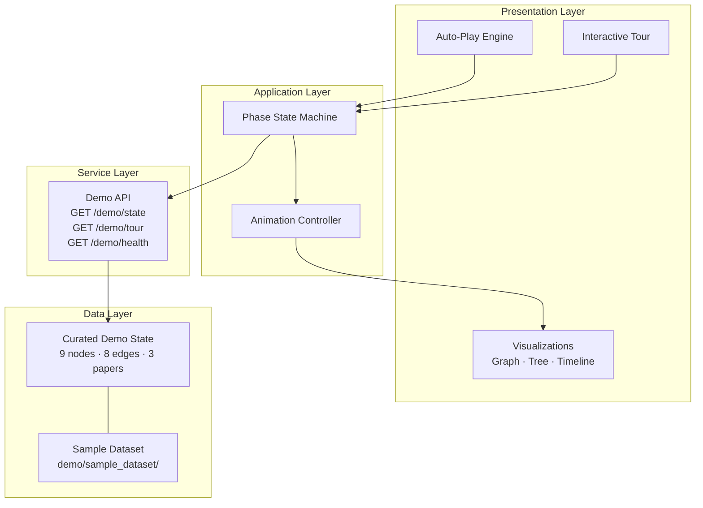

# AXIOM Golden Demo — System Diagram



## Phase State Machine

```
intro → question → papers → extracting → graph → notes
  → contradictions → gaps → hypotheses → experiments → report → complete
```

| Phase | Duration | UI reveal |
|-------|----------|-----------|
| intro | 2s | Hero + CTA |
| question | 2.5s | Research question card |
| papers | 4s | 3 papers sequential read |
| extracting | 3.5s | Progress bar |
| graph | 3s | Evidence graph + stats |
| notes | 2.5s | Structured notes |
| contradictions | 2.5s | VS cards |
| gaps | 2s | Priority gaps |
| hypotheses | 2.5s | Confidence scores |
| experiments | 2.5s | Method + expected outcome |
| report | 3.5s | Full report |
| complete | — | Banner + replay |

## Deployment Topology

```
Browser → Next.js (port 3000) → FastAPI (port 8000) → /demo/state (in-memory)
```

No database required for Golden Demo operation.
